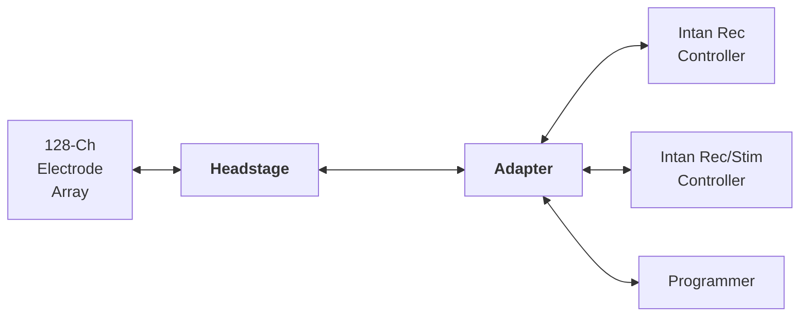

# Iris-128S

<i><b>Figure 1.</b> Iris-128S Neural Interface.</i>

## Description

The Iris-128S neural interface consists of 2 boards: the *headstage* and the *adapter*. The *headstage* is a small electronic board that is normally placed on top of or nearby the animal model being studied. It has been designed to be as small as possible while using standard, commercially available off-the-shelf components. The *adapter* is a small electronic board which has been designed to interface with the Intan Recording Controller, the Intan Rec/Stim Controller, and a programmer/computer to program the switches in the *headstage*.

<i><b>Figure 2.</b> System Architecture of Iris-128S.</i>

### Schematic

<i><b>Figure 3.</b> Schematic of Iris-128S.</i>

## Specifications

* The headstage consists of the input 128-pin connector (*Conn1*), the analog switches (*Switches*), the recording (*R64*) and stimulation (*S16*) chips, and the output 36-pin connector (*Conn2*). This system is shown in the figure below, where the numbers inside the *Conn1* and *Conn2* blocks represent a set of pins from the connector.
* The PCB for the *headstage* has a size of 30.2 x 25.5 mm$^2$.
* *SEAM8 Samtec* connector for interfacing with 128-ch electrode array.
* 

## File Structure

### Top Folders

| Folder  | Subfolders                  | Description    |
| :-----: | :-------------------------- | :------------- |
| iris-128x / pcb | iris-128x   iris-128x-adapter   libraries   datasheets | Project, design, and fabrication files related to Iris-128X headstage PCB fabrication and assembly.   Project, design, and fabrication files related to Iris-128X adapter PCB fabrication and assembly.   Ki-Cad libraries and common files used in PCBs   Datasheets of components used in PCBs. |
| iris-128s / mcu | controller | Project and firmware files related to MCU programming. |
| images    |        | image files used in README and description files. |

### PCB Folders

| Folder  | Subfolders                  | Description    |
| :-----: | :-------------------------- | :------------- |
| iris-128x / pcb / `Iris-PCB` |    manufacturing / gerber   manufacturing / assembly   manufacturing / bom | Project and design files related to `Iris-PCB`.   Gerber files for fabrication of `Iris-PCB`.   Assembly files for `Iris-PCB`.   Bill of Materials for `Iris-PCB`. |

### MCU Folders

| Folder  | Subfolders                  | Description    |
| :-----: | :-------------------------- | :------------- |
| iris-128x / mcu / controller | Core / Inc   Core / Src   Core / Startup   Debug   Drivers | `C` library files.   `C` source files.   Assembly startup file.   Debug-related files.   Driver files for target MCU. |

## File Types

| File | Folder | Description |
| :--- | :----- | :---------- |
| README.md | iris-128x | Description of Iris-128X system. |
| pcb-fab-specs.md | iris-128x / pcb | Specifications for the fabricatin of `Iris-PCB`.
| kicad-files | iris-128x / pcb / `Iris-PCB` | Ki-Cad project and design files. |
| iris-128x-schematic.pdf | iris-128x / pcb / `Iris-PCB` | PDF of PCB schematic. |
| gerber-files | iris-128x / pcb / `Iris-PCB` / manufacturing / gerber | Gerber files. |
| iris-128x-all-pos.csv | iris-128x / pcb / `Iris-PCB` / manufacturing / assembly | Assembly files in `csv` format. |
| iris-128x_bom.csv | iris-128x / pcb / `Iris-PCB` / manufacturing / bom | Bill of materials in `csv` format. |
| datasheet-files.pdf | iris-128x / pcb / datasheets | PDFs of the datasheets of all components used in PCBs. |
| symbol-libraries | iris-128x / pcb / libraries | Ki-Cad symbol libraries used in PCBs. |
| footprint-libraries | iris-128x / pcb / libraries | Ki-Cad footprint libraries used in PCBs. |
| main.c | iris-128s / mcu / controller / Core / Src | Main `C` file running on MCU. |
| c-files | iris-128s / mcu / controller / Core | `C` files related to MCU firmware. |
| c-files | iris-128s / mcu / controller / Debug | `C` files related to MCU debugging. |
| c-files | iris-128s / mcu / controller / Drivers | `C` file related to MCU drivers. |
| .*project | iris-128s / mcu / controller | STM32CubeIDE project-related files. |
| *.launch | iris-128s / mcu / controller | STM32CubeIDE debug-related files. |
| *.ioc | iris-128s / mcu / controller | STM32CubeIDE MCU system configuration file. |
| *.id | iris-128s / mcu / controller | STM32CubeIDE MCU memory configuration file. |