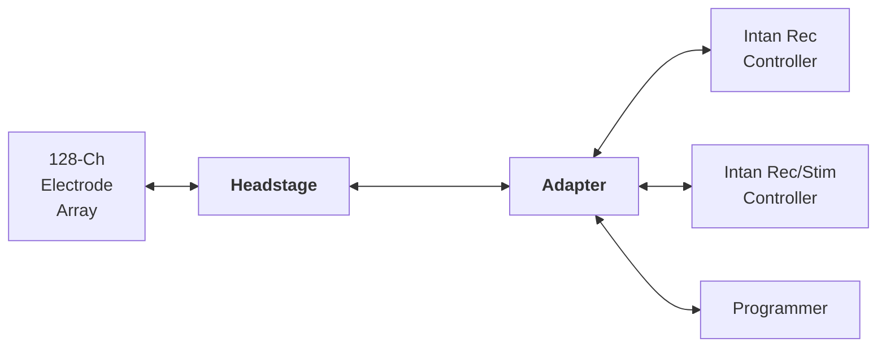

# Iris-128S
> [!NOTE] Documentation Site
> Detail documentation and user guides can be found at https://docs.openic.org/iris-128/iris-128s.

 

<i><b>Figure 1.</b> Iris-128S Neural Interface.</i>

 

## Description

The Iris-128S neural interface consists of 2 boards: the *headstage* and the *adapter*. The *headstage* is a small electronic board that is normally placed on top of or nearby the animal model being studied. It has been designed to be as small as possible while using standard, commercially available off-the-shelf components. The *adapter* is a small electronic board which has been designed to interface with the Intan Recording Controller, the Intan Rec/Stim Controller, and a programmer/computer to program the switches in the *headstage* via a MCU.

The architecture and schematic of Iris-128S are shown in the figures below.

<i><b>Figure 2.</b> System Architecture of Iris-128S.</i>

 

<i><b>Figure 3.</b> Schematic of Iris-128S.</i>

 

## Specifications

* Recording from all 128 channels.
* Stimulation from 32 designated channels, where up to 16 of them can be selected for simultaneous stimulation.
* Compatible with Intan Recording Controller and Intan Stim/Record Controller.
* *SEAM8 Samtec* connector for interfacing with 128-ch electrode array and compatible with *BlackRock Cereplex E headstages*.
* The *headstage* has a size of 30.2 x 25.5 mm$^2$.
* *Omnetics 36-POS* connector to interface with *Adapter* board through a single cable.
* *Adapter* board draws power directly from the Intan Recording Controller to power itself and the *headstage*.
* On-board power management unit (PMU) in the *Adapter* board generates the required supplies for the MCU and *ADGS5414* switches.
* Programmer in the *Adapter* board is only needed to update the firmware in the MCU, i.e., change the state of the *ADGS5414* switches. After MCU is programmed, only the Intan controlleres are needed.
* The *adapter* has a size of 50 x 40 mm$^2$.

 

## File Structure

### Top Folders: /iris-128s

| Folder  | Subfolders                  | Description    |
| :-----: | :-------------------------- | :------------- |
| pcb | iris-128s   iris-128s-adapter   libraries   datasheets | Project, design, and fabrication files related to Iris-128S headstage PCB fabrication and assembly.   Project, design, and fabrication files related to Iris-128S adapter PCB fabrication and assembly.   Ki-Cad libraries and common files used in PCBs   Datasheets of components used in PCBs. |
| mcu | controller | Project and firmware files related to MCU programming. |

 

### PCB Folders: /iris-128s/pcb/`Iris-PCB`

| Folder  | Subfolders                  | Description    |
| :-----: | :-------------------------- | :------------- |
| . / |  | Project and design files related to `Iris-PCB`. |
| manufacturing |  gerber   assembly   bom | Gerber files for fabrication of `Iris-PCB`.   Assembly files for `Iris-PCB`.   Bill of Materials for `Iris-PCB`. |

 

### MCU Folders: /iris-128s/mcu

| Folder  | Subfolders                  | Description    |
| :-----: | :-------------------------- | :------------- |
| controller | Core / Inc   Core / Src   Core / Startup   Debug   Drivers | `C` library files.   `C` source files.   Assembly startup file.   Debug-related files.   Driver files for target MCU. |

 

## File Types

| File | Folder | Description |
| :--- | :----- | :---------- |
| README.md | iris-128x | Description of Iris-128X system. |
| pcb-fab-specs.md | iris-128x / pcb | Specifications for the fabricatin of `Iris-PCB`.
| kicad-files | iris-128x / pcb / `Iris-PCB` | Ki-Cad project and design files. |
| iris-128x-schematic.pdf | iris-128x / pcb / `Iris-PCB` | PDF of PCB schematic. |
| gerber-files | iris-128x / pcb / `Iris-PCB` / manufacturing / gerber | Gerber files. |
| iris-128x-all-pos.csv | iris-128x / pcb / `Iris-PCB` / manufacturing / assembly | Assembly files in `csv` format. |
| iris-128x_bom.csv | iris-128x / pcb / `Iris-PCB` / manufacturing / bom | Bill of materials in `csv` format. |
| datasheet-files.pdf | iris-128x / pcb / datasheets | PDFs of the datasheets of all components used in PCBs. |
| symbol-libraries | iris-128x / pcb / libraries | Ki-Cad symbol libraries used in PCBs. |
| footprint-libraries | iris-128x / pcb / libraries | Ki-Cad footprint libraries used in PCBs. |
| main.c | iris-128s / mcu / controller / Core / Src | Main `C` file running on MCU. |
| c-files | iris-128s / mcu / controller / Core | `C` files related to MCU firmware. |
| c-files | iris-128s / mcu / controller / Debug | `C` files related to MCU debugging. |
| c-files | iris-128s / mcu / controller / Drivers | `C` file related to MCU drivers. |
| .*project | iris-128s / mcu / controller | STM32CubeIDE project-related files. |
| *.launch | iris-128s / mcu / controller | STM32CubeIDE debug-related files. |
| *.ioc | iris-128s / mcu / controller | STM32CubeIDE MCU system configuration file. |
| *.id | iris-128s / mcu / controller | STM32CubeIDE MCU memory configuration file. |